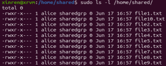
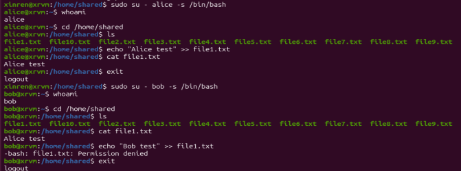
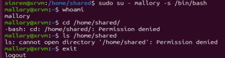
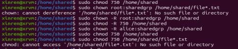

# Session 1b

✅ 1	Apache Web Server Installed	Screenshot or terminal output of sudo apt install apache2 and Apache running at http://127.0.0.1.

✅ 2	Modified index.html Page	Edited /var/www/html/index.html and screenshot showing personalized content when visited via browser or neighbor’s IP. using sudo

✅ 3	IP Address Identified and Shared	Output of ip a showing local and loopback IPs. Partner's IP exchanged and used to access each other's webserver.

-1.png>)

✅ 4	Nmap Port Scan Results	Output screenshot of nmap [partner’s IP] showing open ports before and after Apache is removed.

✅ 5	Firewall (UFW) Status and Rules	Outputs of: 
• sudo ufw status verbose before and after enabling 
• Port 80 allowed and verified via partner’s Nmap scan

✅ 6	SSH Enabled and Tested	Output of successful login via ssh to partner’s machine using both default and explicitly declared usernames.

✅ 7	New User Created and Verified	Command and confirmation of user added via sudo adduser, with /etc/passwd showing new entry.

✅ 8	Compression and Decompression Tested	Screenshots of: 
• tar cf, bzip2, bunzip2, and tar -xvf 
• Output of ls -la showing archive size comparison

✅ 1	Three Users Created	Output showing creation of alice, bob, and mallory using adduser, verified using less /etc/passwd.

✅ 2	Group Created and Configured	groupadd sharedgroup (or similar), with alice and bob added to group via adduser [user] [group]. Verified via less /etc/group.

✅ 3	'shared' Directory Created in /home/	Screenshot or command output confirming: 
• mkdir /home/shared 
• Ownership and group updated via chown, chgrp.
✅ 4	Ten Files Created in 'shared' Folder	Output of touch commands or ls -l /home/shared/ showing 10 files (e.g. file1.txt to file10.txt).

✅ 5	Permissions Assigned Properly	Screenshot of ls -l /home/shared/ showing file permissions: 
✅ 6	Access Verified as Each User	Output of: 
• su - alice, whoami, file access tested (read/write/execute) 
• Same for bob and mallory (showing restricted access).

• alice: rwx 

• bob: r-x 

• mallory: no access

✅ 7	Use of chmod/chown/chgrp -R	Terminal output confirming use of recursive flag: 
• chmod -R, chown -R, chgrp -R applied to directory and files

✅ 8	Mallory Added to Sudoers (Challenge)	Steps taken to add mallory to sudo group: 
• usermod -aG sudo mallory or adduser mallory sudo 
• Verified via groups mallory

✅ 9	Effect of Sudo Access for Mallory Tested	Evidence of Mallory using sudo to access/edit protected files or directories (e.g., /etc, files not owned by her).

✅ 10	Folder Clean-Up Performed	Command used: rm -r /home/shared 
• Screenshot or output confirming deletion of shared directory and its contents.
