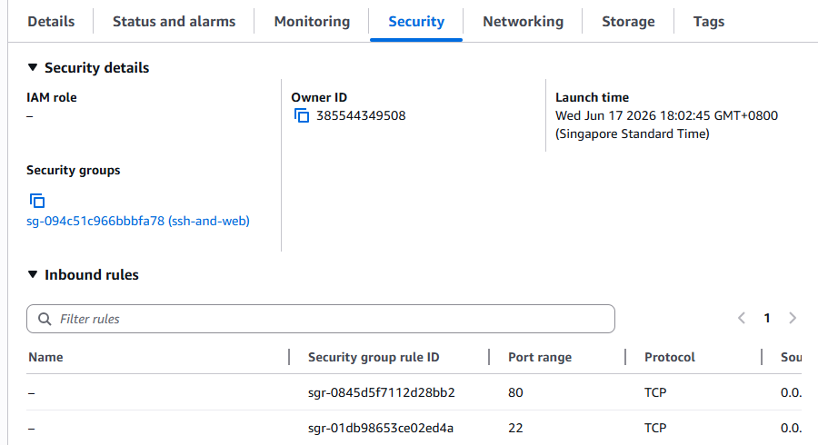
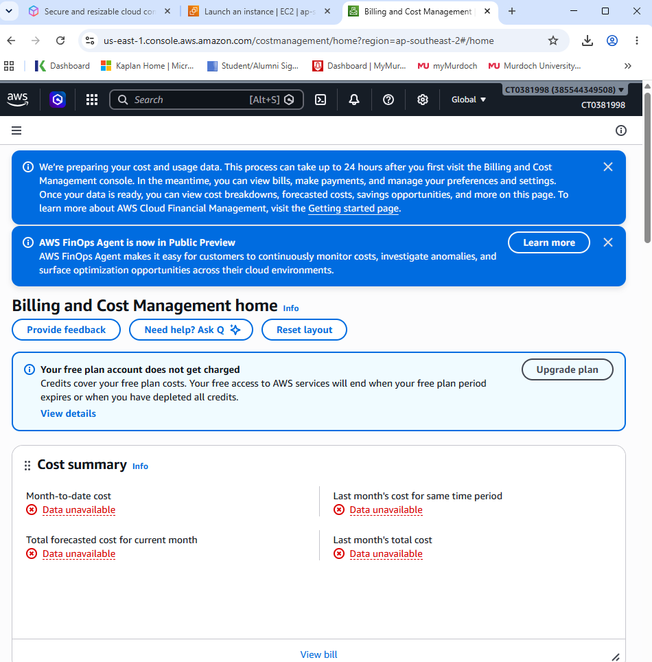
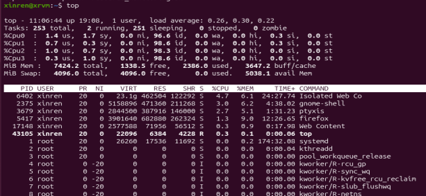

# Session 2b

✅ 1	EC2 Instance Launched	Screenshot of the EC2 dashboard showing the instance running (state = running), with Ubuntu 20.04, free tier eligible, and security group configured.
 

✅ 2	Security Group Configured	Screenshot showing inbound rules: 
• Port 22 (SSH) 
• Port 80 (HTTP) opened

✅ 3	SSH Access Successful	Terminal output showing successful SSH login using the .pem key. Example: ssh -i "yourkey.pem" ubuntu@<public_dns>

✅ 4	Apache Installed and Tested	Output of sudo apt install apache2 and browser screenshot of the Apache welcome page (http://<http://32.236.223.226/>)

✅ 5	Custom index.html Edited	Edited /var/www/html/index.html with personalized content. Screenshot of the file content (nano or gedit) and browser output

✅ 6	External File Downloaded with wget	Screenshot of successful download using wget, e.g., wget http://...EECS-2009-28.pdf, saved in /home/ubuntu

✅ 7	File Copied to Web Root	Screenshot of sudo cp command copying a file to /var/www/html, and ls -l output showing it there with correct permissions

✅ 8	PDF File Accessible via Browser	Screenshot of downloading or viewing http://<public_ip>/EECS-2009-28.pdf from browser or mobile

✅ 9	Link Inserted in HTML Page	index.html edited with a hyperlink to the PDF file. Screenshot of HTML snippet: <a href="EECS-2009-28.pdf">Click here</a> and visible link in browser

✅ 10	Budget Monitoring Enabled	Screenshot of AWS Billing Dashboard with budget alert setup or cost summary

✅ 11	Instance Terminated (Optional)	Screenshot of EC2 instance terminated or stopped, showing awareness of cost management

✅ 1	Directory and File Operations Completed	Screenshot or terminal output of:
• mkdir LabFiles
• Creating notes.txt
• Using cat, cp, mv, rm to manipulate files

✅ 2	Reflection: File System Commands	Written answers to:
• What command did you use to create a directory? mkdir LabFiles
• How can you view file content without a GUI editor? cat notes.txt (quick concantenated view)
• What is the difference between cp and mv? cp = copy, mv = move

✅ 3	Basic Bash Script Created and Run	Evidence of:
• hello_world.sh script created with #!/bin/bash and echo line
• chmod 777 hello_world.sh
• Output of script execution showing custom message

✅ 4	Reflection: Script Basics	Answers to:
• What is chmod +x for? it makes the file as an executable so it can be run as a program using ./hello_world.sh
• Why is #!/bin/bash used? it is the command to tell the system to run the script with the Bash shell
• How can you personalize script output? change the echo message

✅ 5	Loop and Conditional Script	Screenshot or output of system_info.sh:
• Displays user with whoami
• Iteration loop from 1–5
• Input number with if-elif-else logic and validation

✅ 6	Reflection: Loops and Conditionals	Written responses:
• How does the for loop work? it repeats the block of commands
• What happens if number > 10? it depends on the if/elif/else logic, the script will print "Number out of range."
• How could invalid input be handled more gracefully? print a clear error message, and prompt user if want to input again or exit

✅ 7	System Monitoring Script Created and Run	Screenshot or terminal output of:
• resource_monitor.sh looping through system checks:
• top, free -h, and df -h outputs shown

✅ 8	Reflection: Monitoring Automation	Answers to:
• What does free -h show? it displays total used and RAM in readable units (KB, MB, GB)
• How can this script be modified to monitor network usage? add commands like ip -s link, sar -n DEV or ifstat, and sleep to collect and display network traffic perioidically.
• Why is automation important for admins? Automation reduces human error, saves time on repetitive tasks, ensures monitoring and maintenance jobs run consistently without human supervision.
